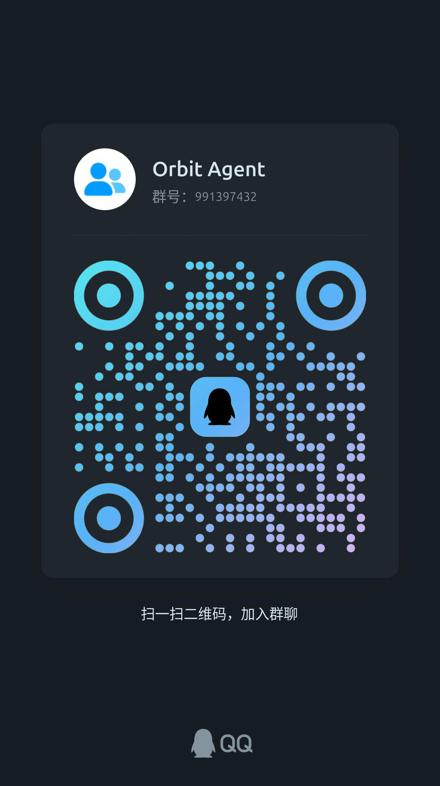

# 🪐 Orbit Agent

[](https://golang.org)
[](LICENSE)
[](https://github.com)
[](https://github.com)

[English](README_EN.md) | [简体中文](README.md)

[✨ Features](#-features) • [🚀 Quick Start](#-quick-start) • [🛠️ Architecture](#️-architecture) • [⌨️ Slash Commands](#️-slash-commands) • [🧩 MCP & Skills](#-mcp--skills-extension) • [🤝 Contributing](#-contributing)

---

## 📖 Overview

A minimalist, loop-driven terminal AI Agent.
Currently in demo stage, with the core philosophy centered around loop-driven execution.

## ✨ Features

- 🧠 **Codex One-Click Login**
  - Supports OpenAI completions & responses compatible protocols, Codex OAuth one-click login, and automatic token refresh.
  - Supports importing subscriptions directly from Codex.
- 🛠️ **Minimalist System Tools & Memory**
  - Streamlined built-in tools to minimize context token overhead.
  - Hierarchical memory architecture (project-level and global-level).
- 🔌 **MCP Support**
  - Native support for standard remote and local Model Context Protocol (MCP) server connections and dynamic tool discovery.
  - Easily extend capabilities with database queries, knowledge base retrieval, or custom external services.
- 🧩 **Skills**
  - Automatically detects skills from other agent ecosystems (such as `.codex`, `.claude`, `.agent`), with flexible toggle on/off controls.
- 💾 **Multi-Session & Memory Management**
  - Lightweight persistence powered by SQLite / JSON, supporting seamless session switching and context rollback.
  - Daily token usage and cost statistics for clear and transparent billing.
- ⚡ **Ultra Lightweight**
  - Single binary delivering all features out of the box.

---

## 📦 Installation

### 1. Download Pre-built Binaries from [Official Releases](https://github.com/Motona-Sky/Orbit-agent/releases)

| Operating System | Architecture | Package Format |
| :--- | :--- | :--- |
| Windows | x86 / ARM | `.zip` archive |
| Linux | x86 / ARM | `.tar.gz` archive |

#### Installation Guide

**Windows**
```powershell
# Run the installation script inside the extracted package
.\install.ps1
```

**Linux**
```bash
# Extract the archive and run the installer script
tar -xzf file.tar.gz
chmod +x ./install.sh
./install.sh
```

### 2. Manual Installation (Build from Source)

#### Clone the Repository
```bash
git clone https://github.com/Motona-Sky/Orbit-agent.git
cd Orbit-agent
```

#### Install Dependencies
```bash
go mod download
```

#### Build the Executable
```bash
go build -o orbit ./cmd/orbit
```

#### Add to Environment Variables (Optional)
Add the compiled `orbit` binary path to your system's `PATH`.

---

## 🚀 Quick Start

Launch the interactive configuration wizard to quickly set your default language, model provider, and API Key:

```bash
# Launch global setup wizard
orbit setup

# Configure model and provider individually
orbit model
# When selecting Codex, it will launch the Codex OAuth login flow
```

### Start Agent Chat

```bash
# Directly launch the TUI interactive interface
orbit

# Enable debug mode (verbose logging)
orbit --debug

# Open the session history selector
orbit -s
# or
orbit session
```

---

## ⌨️ Slash Commands

Type `/` in the terminal input box to open the command completion popup:

| Command | Description |
| :--- | :--- |
| `/model` | Quickly switch or reconfigure the active Large Language Model (LLM) |
| `/provider` | Configure and select the model provider (OpenAI, Codex, custom API, etc.) |
| `/effort` | Set the reasoning effort level for thinking models (`low` / `medium` / `high`) |
| `/skills [name]` | View or toggle specific workflow skills |
| `/mcp` | Inspect and manage connected MCP servers and available tools |
| `/new` | Archive the current conversation and start a fresh session |
| `/clear` | Clear the current screen display (preserves context memory) |

---

## 🧩 MCP & Skills Extension

### Model Context Protocol (MCP)
Orbit provides native MCP support. You can configure MCP servers in user-level `~/.orbit/mcp.json` or project-level `.orbit/`:

```json
{
  "mcpServers": {
    "filesystem": {
      "command": "npx",
      "args": ["-y", "@modelcontextprotocol/server-filesystem", "/path/to/allowed/dir"]
    },
    "github": {
      "command": "npx",
      "args": ["-y", "@modelcontextprotocol/server-github"],
      "env": {
        "GITHUB_PERSONAL_ACCESS_TOKEN": "your-token-here"
      }
    }
  }
}
```

### Skills Mechanism
Place YAML or Markdown skill definitions in the `.orbit/skills/` directory. Orbit will automatically scan, load, and register them under `/skills`, enabling command-driven automation for common development workflows.

---

## 🛠️ Architecture

```
Orbit-agent/
├── cmd/
│   ├── orbit/              # Main CLI entrypoint
│   └── tui-demo/           # Terminal UI component preview & debug program
├── internal/
│   ├── agent/              # Core agent execution loop, context management, tool resolution
│   ├── agentui/            # State and progress UI abstractions
│   ├── billing/            # Daily token usage and cost accounting
│   ├── cli/                # Bubble Tea TUI interface and command router
│   ├── config/             # Config management, persistence, and theme definitions
│   ├── debug/              # Runtime logging and debug tracing
│   ├── event/              # Event streaming system and session events
│   ├── i18n/               # Internationalization / multi-language support (zh-CN / en)
│   ├── llm/                # LLM adapters, streaming, and OAuth authentication
│   ├── mcp/                # MCP client protocol integration and tool bridge
│   ├── memorys/            # Session history, long/short-term memory persistence
│   ├── oauth/              # Codex OAuth login flow and token refresh mechanism
│   ├── prompt/             # Preset system prompts
│   ├── skills/             # Dynamic skill scanning and indexing
│   ├── style/              # Terminal styling themes and ASCII branding
│   ├── tools/              # Native toolset (Exec, Grep, Ls, Read, Update)
│   └── utils/              # General utility helpers
├── access/                 # Static assets (Logos, screenshots, preview GIFs)
└── .orbit/                 # Project-level configuration and skill cache
```

---

## ⚙️ Configuration

Orbit uses a hierarchical configuration approach:
- **User-level Global Config**: `~/.orbit/` (stores sensitive data such as API keys, auth tokens, session databases, etc.)
- **Project-level Config**: `.orbit/` in the repository root (contains repository-specific settings and team-shared skills)

---

## 🤝 Contributing

Contributions via Issues and Pull Requests are warmly welcome! Please keep in mind:

1. **Testing**: Place unit tests in the same package directory (`*_test.go`). Run `go test ./...` to ensure all tests pass.
2. **Security**: Never commit real API tokens, OAuth credentials, or private keys to test code, logs, or git history.
3. **Code Style**: Follow standard Go conventions and the Charmbracelet component design principles.

```bash
# Run unit tests
go test -v ./...

# Static formatting and checking
go fmt ./...
go vet ./...
```

---

## 📄 License

This project is licensed under the [MIT License](LICENSE).

<div align="center">
  <sub>Built with ❤️ by Orbit Contributors</sub>
</div>

---

## 💬 Community



---

## 🗺️ Roadmap

- [ ] Complete in-progress features
- [ ] Multi-agent collaboration framework
- [ ] Permission and access management
- [ ] Extensible plugin ecosystem
- [ ] Advanced loop orchestration mechanism
